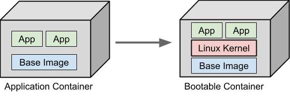
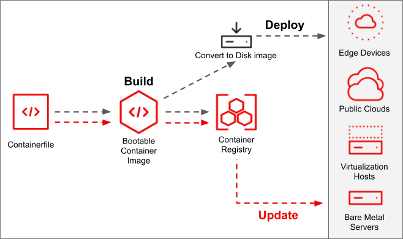

Proceso automatizado con github actions para configurar booteable container a mi gusto basandose en las imagenes de universal blue fedora atomic

Un contenedor booteable es un tipo de contenedor diseñado para ser completamente autónomo, conteniendo todos los componentes necesarios para inicializarse y ejecutarse como si fuera un sistema operativo o aplicación independiente. Estos contenedores suelen incluir un sistema base ligero, las dependencias requeridas y configuraciones específicas, permitiendo que se utilicen en entornos físicos, virtuales o en la nube, optimizando la portabilidad y la consistencia.

https://docs.fedoraproject.org/en-US/bootc/getting-started/